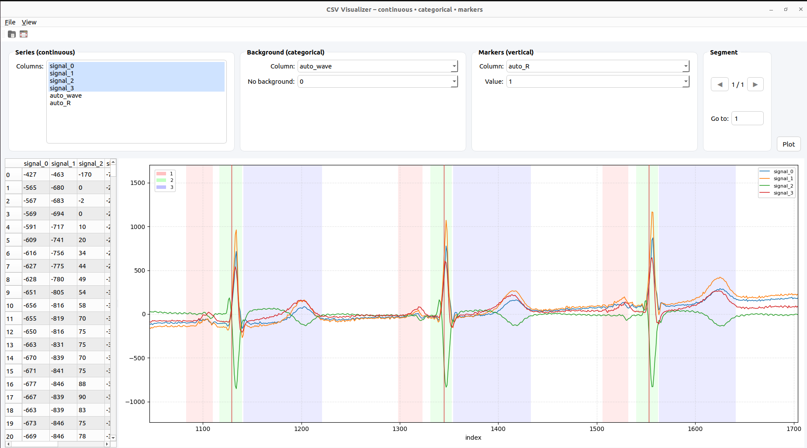

# CSV Visualizer

[](https://github.com/modyf01/csv-visualizer/actions/workflows/build.yml)

CSV visualizer with support for continuous data, categorical backgrounds, and vertical markers. Built with Python, PySide6, and Matplotlib.



## Features

- 📊 Plot multiple continuous data series from CSV files
- 🎨 Categorical background coloring (up to 30 unique values)
- ✏️ **Edit background category values** - select ranges on the plot and reassign values
- 📍 Vertical markers for specific data points
- 🔍 Interactive zoom and pan (scroll to zoom X-axis, Ctrl+scroll for Y-axis)
- 📑 Large file support with automatic chunking (45k rows per segment)
- 🖱️ Double-click or press Esc for plot-only mode
- 📋 Built-in data table view

## Latest builds

<!-- BUILDS:START -->
**Release:** [latest](https://github.com/modyf01/csv-visualizer/releases/tag/latest)

- **Linux (binary)**: [`csv-visualizer-linux`](https://github.com/modyf01/csv-visualizer/releases/download/latest/csv-visualizer-linux)
- **Linux (.deb package)**: [`csv-visualizer_0.1.0_amd64.deb`](https://github.com/modyf01/csv-visualizer/releases/download/latest/csv-visualizer_0.1.0_amd64.deb)
- **Windows**: [`csv-visualizer-windows.exe`](https://github.com/modyf01/csv-visualizer/releases/download/latest/csv-visualizer-windows.exe)
- **macOS Intel (x86_64)**: [`csv-visualizer-macos-intel`](https://github.com/modyf01/csv-visualizer/releases/download/latest/csv-visualizer-macos-intel)
- **macOS Apple Silicon (arm64)**: [`csv-visualizer-macos-arm64`](https://github.com/modyf01/csv-visualizer/releases/download/latest/csv-visualizer-macos-arm64)
<!-- BUILDS:END -->

## Installation

### From .deb (Linux/Debian/Ubuntu)

```bash
sudo dpkg -i csv-visualizer_0.1.0_amd64.deb
```

The application will be available in your application menu with CSV file association.

### From binary

Download the appropriate binary for your platform from the [latest release](https://github.com/modyf01/csv-visualizer/releases/tag/latest) and run it directly.

**Available binaries:**
- `csv-visualizer-linux` - Linux (standalone binary)
- `csv-visualizer_0.1.0_amd64.deb` - Linux (Debian/Ubuntu package)
- `csv-visualizer-windows.exe` - Windows
- `csv-visualizer-macos-intel` - macOS Intel (x86_64)
- `csv-visualizer-macos-arm64` - macOS Apple Silicon (arm64)

**Note:** On macOS, you may need to bypass Gatekeeper: Right-click → Open (first launch only).

## Development

### Requirements

- Python 3.12+
- pandas
- PySide6
- matplotlib

### Setup

```bash
python -m venv .venv
source .venv/bin/activate  # On Windows: .venv\Scripts\activate
pip install -r requirements.txt
python main.py
```

## Usage

### Basic Usage

1. Open a CSV file (Ctrl+O or toolbar button)
2. Select columns to plot from the "Series (continuous)" list
3. Optionally select a categorical column for background coloring
4. Optionally select a column and value for vertical markers
5. Click "Plot" or navigate segments with ◀/▶ buttons

### Editing Category Values

1. Select a categorical column for background
2. **Right-click and drag** on the plot to select a range
3. Choose or enter a new value in "Assign value" dropdown
4. Click "Apply to selection" to update the data
5. The plot will automatically refresh with the new values
6. Save your changes with **Ctrl+S** or File → Save

**Note:** Left-click+drag for panning, right-click+drag for selecting ranges to edit. Window title shows `*` when there are unsaved changes.

### Keyboard shortcuts

- `Ctrl+O` - Open CSV file
- `Ctrl+S` - Save changes to CSV
- `Ctrl+Shift+S` - Save As
- `Esc` - Toggle plot-only mode
- `Scroll` - Zoom X-axis
- `Ctrl+Scroll` - Zoom Y-axis
- `Left-click+Drag` - Pan view
- `Right-click+Drag` - Select range for editing (when category column selected)
- `Double-click` - Toggle plot-only mode

## Building from source

### PyInstaller (standalone executable)

```bash
# Linux (with hidden imports for proper bundling)
pyinstaller --name csv-visualizer --onefile --windowed --icon packaging/icon.png \
  --hidden-import matplotlib.backends.backend_qtagg \
  --hidden-import matplotlib.backends.backend_agg \
  --hidden-import PySide6.QtGui \
  --hidden-import PySide6.QtWidgets \
  --hidden-import PySide6.QtCore \
  main.py

# Windows
pyinstaller --name csv-visualizer --onefile --windowed --icon packaging/icon.ico main.py

# macOS (both Intel and Apple Silicon)
export MACOSX_DEPLOYMENT_TARGET=11.0
pyinstaller --name csv-visualizer --onefile --windowed --icon packaging/icon.icns main.py
```

**Notes:**
- **Linux:** Build on Ubuntu 22.04 or 20.04 for maximum compatibility (GLIBC 2.35/2.31)
- **macOS:** Setting `MACOSX_DEPLOYMENT_TARGET=11.0` ensures compatibility with macOS 11.0+

### Debian package

Requires `fpm`:

```bash
# Build executable first (with hidden imports)
pyinstaller --name csv-visualizer --onefile --windowed --icon packaging/icon.png \
  --hidden-import matplotlib.backends.backend_qtagg \
  --hidden-import matplotlib.backends.backend_agg \
  --hidden-import PySide6.QtGui \
  --hidden-import PySide6.QtWidgets \
  --hidden-import PySide6.QtCore \
  main.py

# Create package structure
mkdir -p pkg/usr/local/bin
mkdir -p pkg/usr/share/applications
mkdir -p pkg/usr/share/pixmaps

cp dist/csv-visualizer pkg/usr/local/bin/csv-visualizer
cp packaging/csv-visualizer.desktop pkg/usr/share/applications/csv-visualizer.desktop
cp packaging/icon.png pkg/usr/share/pixmaps/csv-visualizer.png

# Build .deb with Qt/X11 dependencies
fpm -s dir -t deb -n csv-visualizer -v 0.1.0 \
  --description "CSV visualizer written in Python/PySide6" \
  --depends 'libxkbcommon-x11-0' \
  --depends 'libxcb1' \
  --depends 'libxcb-xinerama0' \
  --depends 'libxcb-cursor0' \
  --depends 'libxcb-render0' \
  --depends 'libxcb-shape0' \
  --depends 'libxcb-xfixes0' \
  --depends 'libxcb-icccm4' \
  --depends 'libxcb-image0' \
  --depends 'libxcb-keysyms1' \
  --depends 'libegl1' \
  -C pkg .
```

**Important:** The dependencies ensure that Qt platform plugin (xcb) and X11 libraries are available.

## License

MIT License - feel free to use and modify.

## Contributing

Pull requests are welcome! For major changes, please open an issue first to discuss what you would like to change.

